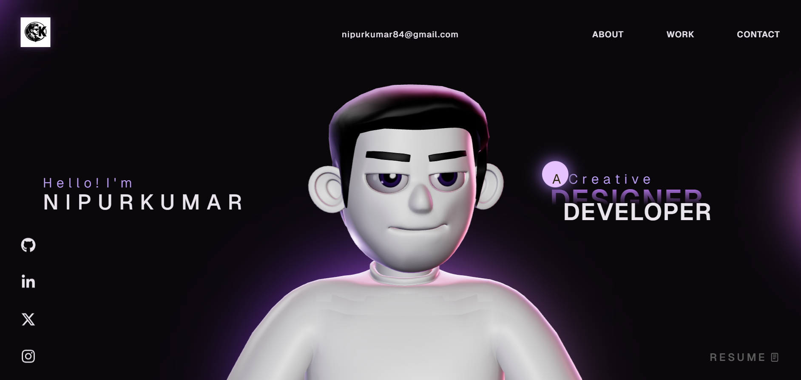

# 🌐 Nipur Kumar — Portfolio

A modern, animated 3D portfolio built with React, Three.js, GSAP, and Lenis to showcase my work as a Blockchain & Full Stack Developer.



---

## 🚀 Live Demo

👉 https://nipur-portfolio.vercel.app

---

## 🛠 Tech Stack

- **Frontend:** React + TypeScript + Vite
- **3D & Animations:** Three.js, GSAP, ScrollTrigger
- **Smooth Scrolling:** Lenis
- **Styling:** CSS3 (custom design system)
- **Hosting:** Vercel

---

## ✨ Features

- Interactive 3D character with mouse tracking
- Smooth scroll navigation
- Animated text reveals
- Responsive design
- Custom AI-generated logo & branding
- Optimized for performance

---

## 📦 Installation

Clone the repository:

```bash
git clone https://github.com/your-username/nipur-portfolio.git
cd nipur-portfolio
npm install
npm run dev


## License

This project is open source and available under the [MIT License](LICENSE).
